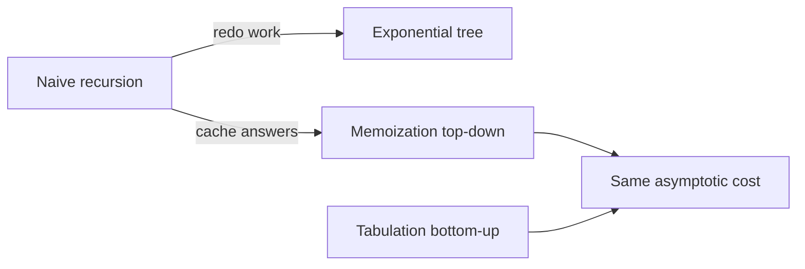

Programação dinâmica (DP)
Resolva problemas de otimização ou contagem reutilizando respostas para **subproblemas sobrepostos**.

**Requisitos**
1. **Subestrutura ideal** — solução ideal construída a partir de subsoluções ideais.
2. **Subproblemas sobrepostos** — o mesmo subproblema aparece muitas vezes em uma árvore de recursão ingênua.

## 1. De cima para baixo versus de baixo para cima



| Estilo | Mecanismo | Prós |
|-------|-----------|------|
| **Memoização** | Recursão + cache (`Map`ou matriz) | Rápido para escrever |
| **Tabulação** | Preencha a tabela em ordem de dependência | Sem profundidade de recursão; muitas vezes mais rápido |

## 2. Fibonacci (exemplo de brinquedo)
Recursão ingênua **O(2ⁿ)**; memorando ou tabela **O(n)**.

```java
// Compile: javac --release 22 …
public static long fibMemo(int n, long[] memo) {
  if (n <= 1) {
    return n;
  }
  if (memo[n] != 0) {
    return memo[n];
  }
  memo[n] = fibMemo(n - 1, memo) + fibMemo(n - 2, memo);
  return memo[n];
}

public static long fibTab(int n) {
  if (n <= 1) {
    return n;
  }
  long[] dp = new long[n + 1];
  dp[0] = 0;
  dp[1] = 1;
  for (int i = 2; i <= n; i++) {
    dp[i] = dp[i - 1] + dp[i - 2];
  }
  return dp[n];
}
```

## 3. Mochila 0/1
**n** itens; o item **i** tem peso **wᵢ** e valor **vᵢ**; capacidade **W**. Cada item **no máximo uma vez**.

**Estado:**`dp[i][c]`= valor máximo usando itens`0..i-1`com capacidade **c**.  
**Transição:** pule o item **i** ou pegue-o se couber.

**Tempo O(n · W)**, **espaço O(n · W)** (ou O(W) com uma linha).

```java
// Compile: javac --release 22 …
public static int knapsack01(int[] weight, int[] value, int capacity) {
  int n = weight.length;
  int[][] dp = new int[n + 1][capacity + 1];
  for (int i = 1; i <= n; i++) {
    for (int c = 0; c <= capacity; c++) {
      dp[i][c] = dp[i - 1][c];
      if (weight[i - 1] <= c) {
        dp[i][c] = Math.max(dp[i][c], dp[i - 1][c - weight[i - 1]] + value[i - 1]);
      }
    }
  }
  return dp[n][capacity];
}
```

## 4. Subsequência comum mais longa (LCS)
**Estado:**`dp[i][j]`= LCS comprimento dos primeiros caracteres **i** de **A** e do primeiro **j** de **B**.

```java
// Compile: javac --release 22 …
public static int lcsLength(String a, String b) {
  int[][] dp = new int[a.length() + 1][b.length() + 1];
  for (int i = 1; i <= a.length(); i++) {
    for (int j = 1; j <= b.length(); j++) {
      if (a.charAt(i - 1) == b.charAt(j - 1)) {
        dp[i][j] = dp[i - 1][j - 1] + 1;
      } else {
        dp[i][j] = Math.max(dp[i - 1][j], dp[i][j - 1]);
      }
    }
  }
  return dp[a.length()][b.length()];
}
```

## 5. Editar distância (Levenshtein)
Inserção/exclusão/substituição mínima para transformar **A** em **B** — clássico **2D DP**, **O(|A| · |B|)**.

## 6. Lista de verificação de design DP
1. Defina **estado** (o que significa subproblema).
2. Escreva **recorrência** + **casos base**.
3. Decida a ordem da iteração (de baixo para cima) ou as chaves de memorando (de cima para baixo).
4. Acompanhe **tempo/espaço** no tamanho da tabela.

## 7. Resolvendo com o JDK (já implementado)

Não há **não**`DynamicProgramming.solve()`em Java. Você usa **arrays** e **maps** o JDK já fornece:

```java
// Compile: javac --release 22 …
import java.util.Arrays;
import java.util.HashMap;
import java.util.Map;

// Bottom-up table
int[][] dp = new int[n + 1][capacity + 1];
Arrays.fill(dp[0], 0);

// Top-down memo — key is often "i,c" or a record
Map<String, Integer> memo = new HashMap<>();
String key = i + "," + c;
if (!memo.containsKey(key)) {
  memo.put(key, solve(i, c)); // fill from recurrence
}
int ans = memo.get(key);

// Edit distance / LCS — still nested loops on int[][]
```

| DP necessidade | JDK |
|--------|-----|
| Mesa 2D |`int[][]`,`long[][]`|
| Memoização |`HashMap`,`Map.computeIfAbsent`|
| Inicializar linha |`Arrays.fill`|
| Mín/máx em recorrência |`Math.min`,`Math.max`|

Apenas para problemas de brinquedos na **escala Fibonacci**,`Map`memorando é suficiente; produção DP permanece **tabelas iterativas** para segurança da pilha.
