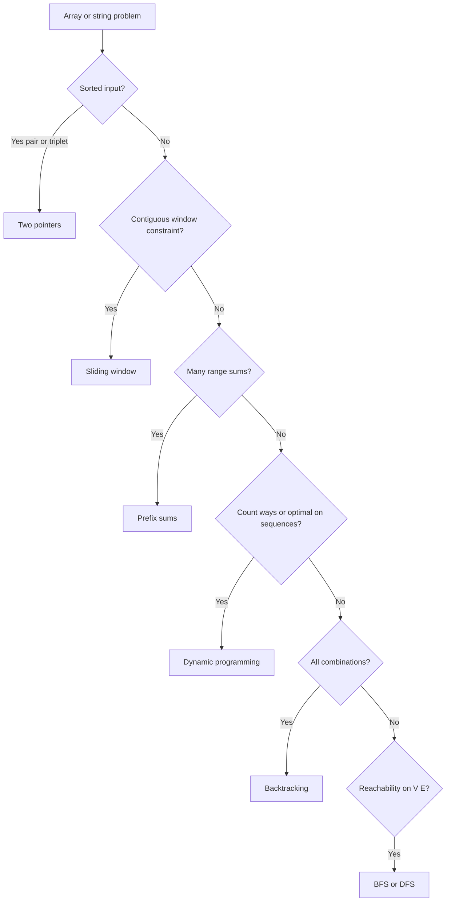

Padrões algorítmicos comuns
Técnicas reutilizáveis em **arrays** e **strings** — geralmente **O(n)** ou **O(n log n)** após a classificação.

## 1. Duas dicas
Dois índices se movem através de uma estrutura um em direção ao outro ou na mesma direção.

**Soma do par de matrizes classificadas** — encontre dois valores com destino **T**:

```java
// Compile: javac --release 22 …
public static boolean hasPairSum(int[] sorted, int target) {
  int lo = 0;
  int hi = sorted.length - 1;
  while (lo < hi) {
    int sum = sorted[lo] + sorted[hi];
    if (sum == target) {
      return true;
    }
    if (sum < target) {
      lo++;
    } else {
      hi--;
    }
  }
  return false;
}
```

**Remover duplicatas no local** (classificado): ponteiro lento para posição de gravação, rápido para digitalização.

## 2. Janela deslizante
Mantenha uma **janela**`[left, right]`em uma matriz; expandir **direita**, encolher **esquerda** quando uma restrição for quebrada.

**Substring mais longa sem caracteres repetidos:**

```java
// Compile: javac --release 22 …
import java.util.HashMap;
import java.util.Map;

public static int longestUniqueSubstring(String s) {
  Map<Character, Integer> last = new HashMap<>();
  int best = 0;
  int left = 0;
  for (int right = 0; right < s.length(); right++) {
    char c = s.charAt(right);
    if (last.containsKey(c) && last.get(c) >= left) {
      left = last.get(c) + 1;
    }
    last.put(c, right);
    best = Math.max(best, right - left + 1);
  }
  return best;
}
```

**Time O(n)** — cada índice se move no máximo **n** passos no total.

## 3. Somas de prefixo`prefix[i]`= soma de`a[0..i-1]`→ soma do intervalo **O(1)** após o pré-processamento **O(n)**.

```java
// Compile: javac --release 22 …
public static int[] prefixSum(int[] a) {
  int[] p = new int[a.length + 1];
  for (int i = 0; i < a.length; i++) {
    p[i + 1] = p[i] + a[i];
  }
  return p;
}

/** Sum of a[lo..hi] inclusive. */
public static int rangeSum(int[] prefix, int lo, int hi) {
  return prefix[hi + 1] - prefix[lo];
}
```

## 4. Contagem de frequência`Map`ou matriz fixa para tamanho do alfabeto - anagramas, elemento majoritário (com Boyer – Moore), problemas de substituição de caracteres.

## 5. Classifique e digitalize
Classifique intervalos, mescle sobreposição; classifique os pares por uma coordenada para agendamento de intervalo ganancioso.

## 6. Seletor de padrões



| Sinal | Experimente |
|--------|-----|
| Entrada classificada, par/tripleto | Duas dicas |
| Restrição contígua de submatriz/substring | Janela deslizante |
| Muitas consultas de soma de intervalo | Somas de prefixo |
| "Contar formas" / ideal em sequências | DP |
| Todas as combinações/permutações | Retrocesso |
| Acessibilidade do gráfico | BFS / DFS |

## 7. Resolvendo com o JDK (já implementado)

```java
// Compile: javac --release 22 …
import java.util.Arrays;
import java.util.HashMap;
import java.util.Map;

// Two pointers — often manual indices on int[] or List.get(i)

// Sliding window + last index of char
Map<Character, Integer> last = new HashMap<>();

// Prefix sums — int[] or long[] (use long if sums overflow)
long[] prefix = new long[a.length + 1];

// Sort then scan (intervals, pair problems)
Arrays.sort(intervals, (x, y) -> Integer.compare(x[0], y[0]));

// Frequency
Map<String, Long> freq = new HashMap<>();
freq.merge(token, 1L, Long::sum);

// Stream shorthand (know the cost: sort is O(n log n))
int[] sorted = Arrays.stream(nums).sorted().toArray();
```

| Padrão | JDK ajudantes |
|--------|-------------|
| Duas dicas | índices na matriz /`List`|
| Janela deslizante |`HashMap`,`HashSet`|
| Soma do prefixo |`long[]`,`Arrays`|
| Classificar + digitalizar |`Arrays.sort`,`Comparator`|
| Contagem |`Map.merge`,`getOrDefault`|

Veja **[Resolvendo com o JDK](xi-solving-with-the-jdk.md)** para obter uma folha de dicas completa.
